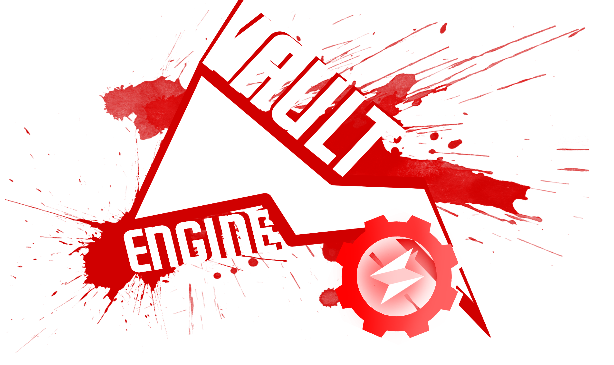

<p align="center">
  <a href="https://godotengine.org">
    
  </a>
</p>

## 2D and 3D cross-platform game engine made with love & spaghetti code

**Vault Engine** is a cross platform (mostly) 2D & 3D Game Engine inspired by Unity's simple UI & scripting API. This Game Engine is mostly made for myself and I also use it as a simple renderer for some projects.

## Supported Platforms:

- **Linux**
- **Windows**

## Used Dependencies

- [**Assimp**](https://github.com/assimp/assimp)
- [**Box2D**](https://github.com/erincatto/box2d)
- [**Discord RPC**](https://github.com/discord/discord-rpc)
- [**Freetype**](https://freetype.org/)
- [**ImGuizmo**](https://github.com/CedricGuillemet/ImGuizmo)
- [**EnTT**](https://github.com/skypjack/entt)
- [**GLFW**](https://www.glfw.org/)
- [**glm**](https://github.com/g-truc/glm)
- [**IconFontCppHeaders**](https://github.com/juliettef/IconFontCppHeaders)
- [**ImGui**]()
- [**ImGuiFileDialog**](https://github.com/aiekick/ImGuiFileDialog)
- [**yaml-cpp**](https://github.com/jbeder/yaml-cpp)
- [**SDL/SDL_mixer**](https://www.libsdl.org/)
- [**stb_image**](https://github.com/nothings/stb)
- [**tinyxml2**](https://github.com/leethomason/tinyxml2)
- [**Bullet Physics**](https://github.com/bulletphysics/bullet3)
- [**OpenAL**](https://www.openal.org/)
- [**efsw**](https://github.com/SpartanJ/efsw)
- [**sndfile**](https://github.com/libsndfile/libsndfile)
- [**Mono**](https://www.mono-project.com/)
- [**Themes from/inspired from ImThemes**](https://github.com/Patitotective/ImThemes)

# Huge thanks to

- **BD for remaking the logo and making the banner! https://twitter.com/bd_doodle (will update this once he tells me what he changed his handle to lmfao)**

# Installation
Do not forget to create folders that are required if they're missing.
## **Linux**

```bash
git clone https://github.com/koki10190/Vault-Engine.git
cd Vault-Engine
./run.sh
```

If it fails you probably do not have g++ & CMake installed.

## **Windows**
Change `x86_64-w64-mingw32-cmake` to just `cmake` on **Windows** or whatever CMake command is on there 

```bash
git clone https://github.com/koki10190/Vault-Engine.git
cd Vault-Engine
x86_64-w64-mingw32-cmake -DCMAKE_POLICY_VERSION_MINIMUM=3.5 -DPROJECT_SELECTOR=FALSE -DASSIMP_WARNINGS_AS_ERRORS=OFF -DBUILD_SHARED_LIBS=OFF -DASSIMP_BUILD_TESTS=OFF -S . -B ./windows/build
cd ./windows/build
make
```

# **Cross-Platform Issues**

- 3D Audio - Linux build is able load mp3 files while windows build can only load WAV files. (this is an issue with sndfile)

# **C# Scripting**
If you want to use C# for scripting **you need to have dotnet and the sdk installed!** and the path set!